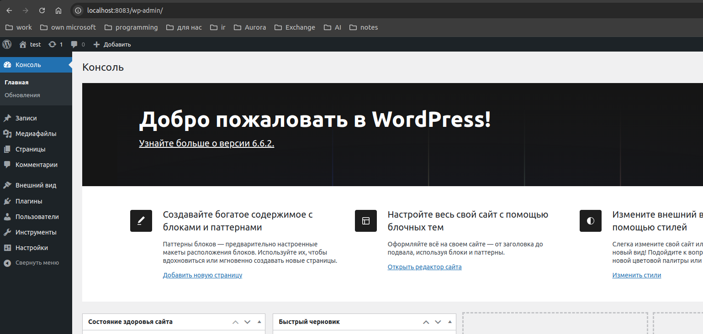

# web

Разворачиваем ВМ.  
после запускатеся ansible с установкой docker и запуском контейнеров.  
Список контейнеров после запуска:  

vagrant@DynamicWeb:~$ docker ps
CONTAINER ID   IMAGE                        COMMAND                  CREATED         STATUS         PORTS                                                                   NAMES
0099691760d2   nginx:1.27.2-alpine          "/docker-entrypoint.…"   5 minutes ago   Up 5 minutes   80/tcp, 0.0.0.0:8081-8083->8081-8083/tcp, :::8081-8083->8081-8083/tcp   nginx  
dee924937dc5   wordpress:6.6.2-fpm-alpine   "docker-entrypoint.s…"   5 minutes ago   Up 5 minutes   9000/tcp                                                                wordpress  
6823981a10e2   project-app                  "gunicorn --workers=…"   5 minutes ago   Up 5 minutes                                                                           app  
e0f23d30180c   mysql:8                      "docker-entrypoint.s…"   5 minutes ago   Up 5 minutes   3306/tcp, 33060/tcp                                                     database  
8ffa64d27d88   node:16.13.2-alpine3.15      "docker-entrypoint.s…"   5 minutes ago   Up 5 minutes                                                                           node  

тест доступности сервисов:

